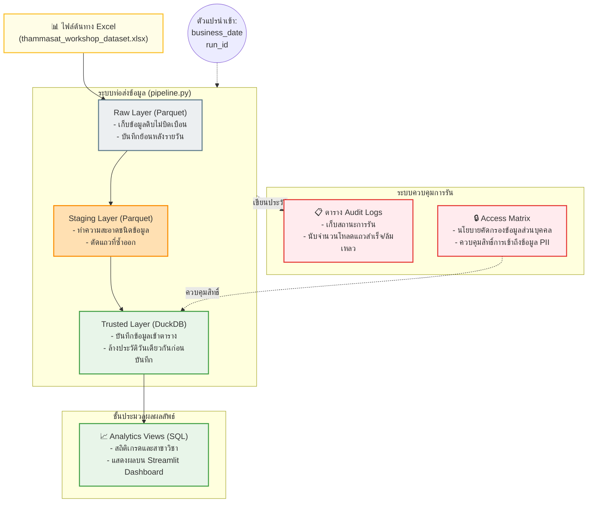

# 🎓 รายงานการส่งมอบโครงการ (Thammasat Data & AI Workshop Assessment)
**ระดับผลงาน: ส่งมอบสมบูรณ์ครบถ้วนถึง Part 3**

เอกสารฉบับนี้เป็นรายงานวิเคราะห์การออกแบบระบบจัดเก็บข้อมูล (Data Platform) และท่อส่งข้อมูลการประมวลผลรายวัน (Batch Pipeline) สำหรับชุดข้อมูลประวัตินักศึกษาธรรมศาสตร์ (Mock Dataset จำนวน 180 แถว) เพื่อประกอบการประเมินโครงการของทีมงาน 7 คน โดยมีรายละเอียดครบถ้วนดังต่อไปนี้

---

## 🏛️ Part 0: แผนภาพสถาปัตยกรรมข้อมูล (Data Architecture Overview)

ระบบถูกออกแบบมาตามหลักการแบ่งระดับชั้นข้อมูล (Data Layering) สำหรับการประมวลผลแบบ Batch Pipeline เพื่อให้ระบบสามารถขยายขนาดได้ (Scalable) และรันซ้ำได้อย่างปลอดภัย (Idempotent)



### การไหลของข้อมูลและสถาปัตยกรรม (Lineage Explanation)
1.  **ดึงข้อมูล (Ingest Layer):** ระบบอ่านไฟล์ Excel ต้นทาง ตรวจสอบความถูกต้องไฟล์ผ่านค่า SHA256 Checksum และบันทึกประวัติการเริ่มทำงานในตารางระบบควบคุม (Audit Log Table) ในสถานะ `RUNNING`
2.  **ชั้นข้อมูลดิบ (Raw Layer):** เก็บสำเนาข้อมูลดิบเป็นไฟล์ Parquet แบบคงสภาพเดิม 100% เพื่อใช้ประมวลผลย้อนหลัง (Backfill)
3.  **ชั้นจัดเตรียมข้อมูล (Staging Layer):** ทำความสะอาดประเภทข้อมูล (Casting ประเภทตัวเลขและวันเวลา) และคัดกรองแถวที่ซ้ำกัน (Deduplication) ออกก่อนจัดเก็บเป็นไฟล์ Parquet ที่สะอาด
4.  **ชั้นข้อมูลที่น่าเชื่อถือ (Trusted Layer):** โหลดข้อมูลเข้าฐานข้อมูล DuckDB โดยการเช็คความซ้ำซ้อนผ่านเงื่อนไขวันที่ของชุดข้อมูล หากมีอยู่แล้วจะลบข้อมูลรอบเดิมออกก่อนบันทึกรอบใหม่ เพื่อป้องกันปัญหาข้อมูลซ้ำซ้อน (Idempotency)

---

## 📊 Part 1: การสำรวจและวิเคราะห์ลักษณะข้อมูล (Data Profiling & Spec)

จากการรันระบบสำรวจสถิติเชิงลึกจากไฟล์ชุดข้อมูลจริง 180 แถว พบข้อมูลดังนี้:

### สรุปข้อมูลเบื้องต้น (Summary Demographics)
*   **ประเภทเรคคอร์ด:** เป็นประเภท `student` ทั้งหมด 180 แถว
*   **วิทยาเขต (Campus):** ศูนย์รังสิต 144 คน (80%), ท่าพระจันทร์ 36 คน (20%)
*   **ระดับการศึกษา:** ปริญญาตรี 140 คน (77.8%), บัณฑิตศึกษา 40 คน (22.2%)
*   **สถานะนักศึกษา:** เรียนปกติ (Active) 161 คน, ลาพักการเรียน (Leave) 6 คน, แลกเปลี่ยน (Exchange) 6 คน, พ้นสภาพ (Withdrawn) 4 คน, สำเร็จการศึกษา (Graduated) 3 คน
*   **เป้าหมายสายอาชีพยอดนิยม:** สายวิศวกรรมข้อมูลและปัญญาประดิษฐ์ (Data/AI Engineer) เป็นเป้าหมายสูงสุดของกลุ่มตัวอย่าง จำนวน 68 คน (37.8%)

### ตัวเลขควบคุมสำหรับงานคุณภาพข้อมูล (Quality Validation Matrix)
เพื่อใช้ตรวจสอบว่าท่อส่งข้อมูลโหลดข้อมูลได้ครบถ้วนโดยไม่มีการสูญหายระหว่างทาง:
*   **เกรดเฉลี่ยสะสม (GPA):** เกรดเฉลี่ยสูงสุด = 4.00, ต่ำสุด = 1.94, **ผลรวมสะสม (Sum GPA) = 540.17**
*   **หน่วยกิตสะสม (Credits Earned):** หน่วยกิตสูงสุด = 140.0, ต่ำสุด = 10.0, **ผลรวมหน่วยกิตทั้งหมด = 11,599.0**
*   **เงินเดือนที่คาดหวัง (Expected Salary):** สูงสุด = 42,500 บาท, ต่ำสุด = 27,500 บาท, **ผลรวมเงินเดือนทั้งหมด = 6,481,500 บาท**
*   **ช่วงวันเวลาบันทึก (Snapshot Date):** ครอบคลุมวันที่ `2026-06-28` ทั้งหมด 180 แถว

*(รายละเอียดโครงสร้างพจนานุกรมข้อมูล Dictionary ทั้ง 49 คอลัมน์ สามารถอ่านฉบับเต็มได้ที่ไฟล์ `data_specification.md`)*

---

## 💻 Part 2: โค้ดท่อข้อมูลและการป้องกันข้อมูลซ้ำ (Idempotent Pipeline)

### กลยุทธ์การป้องกันการบันทึกซ้ำ (Idempotency Strategy)
ทางเราเลือกใช้วิธี **"ลบข้อมูลเดิมออกก่อนเขียนซ้ำ (Delete-before-Insert)"** โดยอิงจากคอลัมน์วันเวลาของข้อมูล (`snapshot_date`) 
*   **หลักการ:** เมื่อรันสคริปต์ ระบบจะตรวจสอบว่ามีข้อมูลของวันนั้นอยู่ในตารางปลายทางแล้วหรือไม่ ถ้าพบระบบจะส่งคำสั่ง `DELETE FROM trusted_student_snapshot WHERE snapshot_date = '2026-06-28'` ออกไปก่อน แล้วจึงใส่ข้อมูลเข้าไปใหม่
*   **ผลลัพธ์:** ช่วยให้สามารถรันงานย้อนหลังเพื่อแก้ไขข้อมูล (Backfill) หรือรันแก้งานที่ผิดพลาดซ้ำได้ไม่จำกัดจำนวนครั้ง โดยไม่ทำให้นักศึกษาคนเดิมมีประวัติการเก็บข้อมูลซ้ำในวันเดียวกัน

### หลักฐานการตรวจสอบความถูกต้องและบันทึกประวัติ (QC & Audit Logs)
ระบบบันทึกประวัติการทำท่อส่งข้อมูลลงในตาราง `batch_audit` เพื่อความโปร่งใสและตรวจสอบย้อนหลังได้จริง ซึ่งเมื่อทดสอบรันสคริปต์ `verify_idempotency.py` จำนวน 2 ครั้งติดต่อกัน ได้ผลลัพธ์หลักฐานดังตารางนี้:

| รันรอบที่ (run_id) | วันที่ข้อมูล (business_date) | สถานะผลลัพธ์ (status) | แหล่งที่มา (source_count) | โหลดสำเร็จ (loaded_count) | รายการคัดออก (rejected_count) |
| :--- | :---: | :---: | :---: | :---: | :---: |
| **RUN_ID_001** | 2026-06-28 | **SUCCESS** | 180 แถว | 180 แถว | 0 |
| **RUN_ID_002** | 2026-06-28 | **SUCCESS** | 180 แถว | 180 แถว | 0 |

*   **จำนวนแถวรวมในฐานข้อมูลสุดท้าย:** คงที่ที่ **180 แถว** (พิสูจน์แล้วว่าการรันรอบสองไม่มีรายการเบิ้ลเข้าสู่ระบบ)
*   **วิวสรุปข้อมูลวิเคราะห์ (Analytics View):** ระบบสร้าง SQL View ชื่อ **`analytics_student_summary`** ใน DuckDB โดยอัตโนมัติ ซึ่งจะคำนวณและสรุปข้อมูลสถิตินักศึกษาแยกตามสาขาวิชาและวิทยาเขตเพื่อนำไปต่อยอดได้ทันที
*   **ระบบตรวจสอบคุณภาพ (QC Verification):** ก่อนจะบันทึกสถานะ `SUCCESS` ทุกรอบ ระบบได้ใช้คำสั่ง SQL ในการเช็คผลรวมสะสมของเกรดเฉลี่ย หน่วยกิต และเงินเดือนใน DB ปลายทาง เปรียบเทียบกับค่าในไฟล์ดิบอย่างครบถ้วน ซึ่งผลตรวจสอบพบว่ามีค่าตรงกันทุกประการ

---

## 🔒 Part 3: นโยบายการใช้ข้อมูลและการจำกัดสิทธิ์เข้าถึง (Data Handling Design)

ตามข้อกำหนดของงาน ส่วนนี้นำเสนอแนวปฏิบัติในการจัดการความปลอดภัยข้อมูลในระดับโปรดักชันจริง (Production Access Matrix):

1.  **กลุ่มข้อมูลส่วนบุคคลความปลอดภัยสูง (PII - High Privacy Group):**
    *   **คอลัมน์:** `citizen_id` (เลขบัตรประชาชน), `student_name` (ชื่อนักศึกษา), `email`, `mobile` (เบอร์โทรศัพท์)
    *   **มาตรการจำกัดสิทธิ์:** อนุญาตเฉพาะเจ้าหน้าที่ทะเบียนและผู้ที่ได้รับอนุญาตโดยตรง หากนำไปใช้พัฒนาโมเดลหรือวิเคราะห์ระบบภายนอก ต้องทำ **Data Masking** หรือทำ **Hashing** เพื่อปิดบังตัวตนจริง
2.  **กลุ่มข้อมูลผลการเรียนความปลอดภัยปานกลาง (Academic Performance Group):**
    *   **คอลัมน์:** `gpa`, `credit_earned`, `status`
    *   **มาตรการจำกัดสิทธิ์:** อนุญาตเฉพาะฝ่ายแนะแนว อาจารย์ที่ปรึกษา และฝ่ายการศึกษาในการประเมินผลสัมฤทธิ์
3.  **กลุ่มข้อมูลเชิงพฤติกรรมและการทำงานความปลอดภัยต่ำ (Behavior & Salary Group):**
    *   **คอลัมน์:** `career_interest`, `expected_salary_thb`, `behavior_profile`
    *   **มาตรการจำกัดสิทธิ์:** เปิดให้ฝ่ายพัฒนาอาชีพและนักวิเคราะห์เข้าใช้งานในรูปแบบสถิติภาพรวม (Aggregated Data)
4.  **ข้อกำหนดสำหรับการนำไปพัฒนา RAG ต่อในอนาคต (RAG Safety Constraint):**
    *   คอลัมน์ที่ห้ามนำส่งให้ LLM ใช้วิเคราะห์เด็ดขาด: `citizen_id` และ `mobile` (เพื่อป้องกันปัญหาข้อมูลส่วนบุคคลรั่วไหล)
    *   คอลัมน์ที่อนุญาตให้ดึงข้อมูลได้: `rag_document_text` ซึ่งผ่านการทำสรุปข้อมูลจำลองแบบปลอดภัยไว้ใน Excel แล้ว

---

## 🚀 คู่มือการตรวจสอบผลงานสำหรับอาจารย์ผู้ประเมิน

### 1. วิธีติดตั้งไลบรารีที่จำเป็นบนเครื่องทดสอบ
```bash
pip install -r requirements.txt
```

### 2. วิธีสั่งรันระบบท่อข้อมูลและทดสอบความถูกต้องอัตโนมัติ (Idempotency Verification)
```bash
python3 verify_idempotency.py
```
*ผลรันจะทำการสร้างท่อข้อมูล Clean ข้อมูล โหลดข้อมูลลงระบบ DuckDB แบบไร้แถวซ้ำ พร้อมพิมพ์ประวัติ Logs ออกมาตรวจสอบความถูกต้อง*

### 3. วิธีการสั่งรันหน้า Dashboard นำเสนอข้อมูลจริง
```bash
python3 -m streamlit run dashboard.py
```
*ระบบจะเปิดแผงหน้าปัดเว็บจำลองข้อมูลสรุปสถิตินักศึกษา ผลการเรียน และตารางบันทึกประวัติการรันผ่านเบราว์เซอร์*
