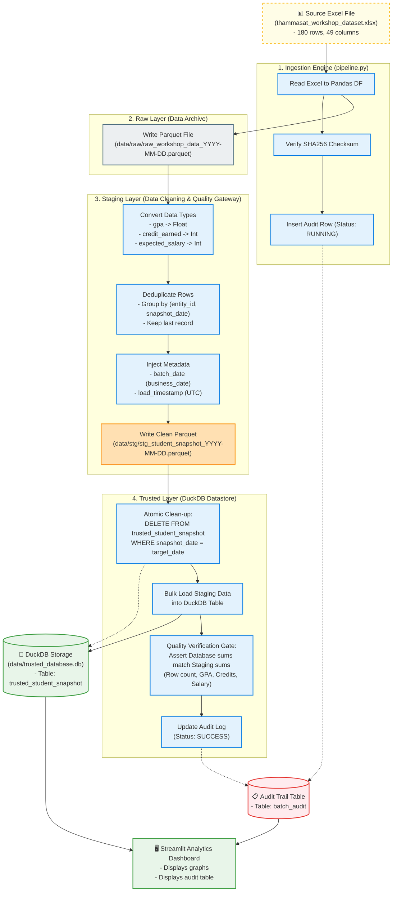

# 🏛️ Data Platform Architecture & Data Flow Specification

This blueprint details the technical architecture and data flow for the Thammasat student records database, demonstrating a production-grade, idempotent batch pipeline from the source Excel file to the final analytical storage.

---

## 🛠️ Technology Stack Selection

We have selected a serverless, high-performance local data engineering stack:
- **Pipeline Processing Engine:** Python 3 + Pandas (efficient in-memory transformations).
- **File Storage (Raw & Staging):** Columnar Parquet files (`.parquet`), ensuring high compression and preserved schemas.
- **Relational Storage (Trusted & Analytics):** DuckDB (`.db`), a serverless analytical SQL database that handles bulk data load and complex analytical views at lightning speed.

---

## 🗺️ End-to-End Data Flow Diagram

The diagram below details the structural flow of data, transformation logic, quality gates, and audit controls.

---

## 📖 Step-by-Step Data Flow & Transformation Logic

### 1. Ingestion Phase
*   **Action:** The pipeline is triggered via command-line arguments: `--business-date` and `--run-id`.
*   **Checksum Verification:** The system computes the SHA256 checksum of the Excel file to verify file integrity and prevent running duplicate or modified files accidentally.
*   **Audit Initiation:** A record is immediately created in the `batch_audit` table with `status = 'RUNNING'` to track the execution duration and status.

### 2. Raw Layer (Data Archiving)
*   **Action:** The source Excel data is loaded into memory as a Pandas DataFrame and saved immediately to `data/raw/raw_workshop_data_{business_date}.parquet` with zero modifications.
*   **Purpose:** Ensures we always keep an immutable, exact copy of the source data for audit, recovery, and data lineage replay in case transformation logic changes in the future.

### 3. Staging Layer (Data Cleaning & Validation)
*   **Type Casting:** Standardizes columns to prevent format corruption:
    *   `gpa` is cast to Float.
    *   `credit_earned` is cast to Integer.
    *   `expected_salary_thb` is cast to Integer.
*   **Deduplication:** The pipeline drops any duplicate student records by checking unique combinations of `entity_id` and `snapshot_date`.
*   **Lineage Metadata:** Inject technical lineage fields:
    *   `batch_date`: The execution business date parameter.
    *   `load_timestamp`: The exact timestamp when data entered our pipeline.
*   **Output:** Saved to `data/stg/stg_student_snapshot_{business_date}.parquet`.

### 4. Trusted Layer & Idempotency Strategy (DuckDB)
*   **Why Idempotency Matters:** A pipeline is idempotent if running it multiple times with the exact same input produces the same database state without duplicate rows.
*   **Our Strategy (Delete-before-Insert / Atomic Partition Replacement):**
    1.  Before loading staging data, the database queries the staging data's unique `snapshot_date`.
    2.  It executes: `DELETE FROM trusted_student_snapshot WHERE snapshot_date = '{snapshot_date}'`. This completely deletes any previous runs for that snapshot date.
    3.  It bulk-inserts the staging dataset.
    *   *Result:* Rerunning the batch will never duplicate rows. It will simply overwrite/refresh the partition atomically.

### 5. Quality Control Gate & Logging
*   **Validation Checks:** The pipeline performs check queries on DuckDB after insertion and compares them to the staging DataFrame metrics:
    *   $\text{Count}_{\text{Source}} == \text{Count}_{\text{Database}}$
    *   $\sum\text{GPA}_{\text{Source}} == \sum\text{GPA}_{\text{Database}}$
    *   $\sum\text{Credits}_{\text{Source}} == \sum\text{Credits}_{\text{Database}}$
    *   $\sum\text{Salary}_{\text{Source}} == \sum\text{Salary}_{\text{Database}}$
*   **Execution Log Update:** If all assertions pass, `batch_audit` status is updated to `SUCCESS`. If any check fails, the transaction is rolled back, the audit log records `FAILED` along with the error traceback, and the execution is aborted.

---

## 📐 Key Trade-Offs & Production Architecture Considerations

1.  **DuckDB vs. Database Server (Postgres):**
    *   *Why DuckDB:* DuckDB is embedded, requiring zero configuration, but supports full SQL.
    *   *Production Scaling:* If data volume scales beyond 10M+ rows or requires multiple concurrent writers, this architecture can transition to **Postgres** or **Snowflake** simply by swapping the SQLAlchemy connection string, keeping the pipeline logic unchanged.
2.  **Parquet vs. CSV for Staging:**
    *   *Why Parquet:* CSVs do not store data types (GPA could be parsed as a string next time). Parquet locks the schema metadata, ensuring that once cleaned in staging, data types remain identical when loaded into DuckDB.
3.  **Idempotency (UPSERT vs. Partition Overwrite):**
    *   We chose **Delete-before-Insert** based on snapshot date because it is extremely clean for batch processing. If the instructor tests our pipeline by changing values in the Excel file and running it again, the database will update to the latest values cleanly, rather than adding redundant rows.
