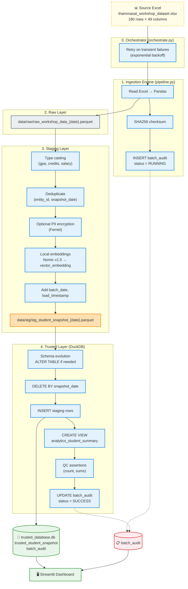
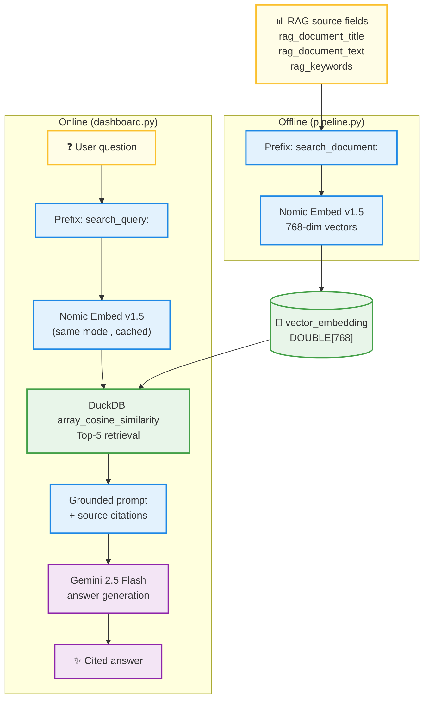

# Data Platform Architecture

Technical blueprint for the Thammasat student analytics platform: a medallion-style batch pipeline from Excel source to DuckDB trusted storage, with a hybrid RAG serving layer.

---

## Table of Contents

- [Technology Stack](#technology-stack)
- [System Components](#system-components)
- [End-to-End Data Flow](#end-to-end-data-flow)
- [Layer-by-Layer Logic](#layer-by-layer-logic)
- [Idempotency Strategy](#idempotency-strategy)
- [Quality Control Gates](#quality-control-gates)
- [RAG Architecture](#rag-architecture)
- [Observability & Audit](#observability--audit)
- [Production Trade-offs](#production-trade-offs)

---

## Technology Stack

| Concern | Choice | Rationale |
| :--- | :--- | :--- |
| Batch processing | Python 3 + Pandas | Fast in-memory transforms for workshop-scale data |
| File storage | Parquet | Schema-preserving, compressed columnar archives |
| Analytical database | DuckDB (embedded) | Zero-ops SQL engine with native array/vector functions |
| Embeddings | `nomic-ai/nomic-embed-text-v1.5` via SentenceTransformers | Local, 768-dim, no API quota for vectorization |
| LLM generation | Google Gemini (`gemini-2.5-flash`) | Grounded natural-language answers in dashboard |
| Serving UI | Streamlit | Rapid analytics and RAG prototyping |
| PII protection | Fernet (AES-128-CBC + HMAC) via `cryptography` | Optional column-level encryption at ingest |

---

## System Components

```text
┌─────────────────────────────────────────────────────────────────┐
│                        ENTRY POINTS                              │
├─────────────────────┬───────────────────────┬───────────────────┤
│  orchestrate.py     │  verify_idempotency.py │  dashboard.py     │
│  Production runs    │  CI / evidence runs    │  Human consumers  │
└──────────┬──────────┴───────────┬───────────┴─────────┬─────────┘
           │                      │                     │
           ▼                      ▼                     ▼
      pipeline.py            pipeline.py ×2         DuckDB (read-only)
           │                      │                     │
           └──────────────────────┴─────────────────────┘
                                  │
                                  ▼
                    data/trusted_database.db
```

| Component | File | Responsibility |
| :--- | :--- | :--- |
| Orchestrator | `src/orchestrate.py` | Subprocess wrapper, env checks, retry on transient errors |
| Pipeline | `src/pipeline.py` | ETL, embeddings, QC assertions, audit updates |
| Verifier | `src/verify_idempotency.py` | Cleans `data/`, runs pipeline twice, asserts row stability |
| Dashboard | `src/dashboard.py` | Analytics, audit viewer, RAG Q&A, SQL explorer |

---

## End-to-End Data Flow



---

## Layer-by-Layer Logic

### 1. Ingestion trigger

The pipeline is invoked with CLI arguments:

| Argument | Purpose |
| :--- | :--- |
| `--business-date` | Partition key written to `batch_date` |
| `--run-id` | Unique identifier in `batch_audit` |
| `--input-file` | Source Excel path |
| `--sheet-name` | Worksheet to read (default: `workshop_data`) |

On start, the pipeline computes a SHA256 checksum of the input file and inserts an audit row with `status = 'RUNNING'`.

### 2. Raw layer (immutable archive)

- **Input:** Excel workbook, unchanged.
- **Output:** `data/raw/raw_workshop_data_{business_date}.parquet`
- **Purpose:** Lineage replay — if transform logic changes, raw data can be reprocessed without re-sourcing.

### 3. Staging layer (clean + enrich)

| Step | Logic |
| :--- | :--- |
| Type casting | `gpa` → float; `credit_earned`, `expected_salary_thb` → int |
| Deduplication | `drop_duplicates(['entity_id', 'snapshot_date'], keep='last')` |
| PII encryption | If `PII_ENCRYPTION_KEY` is set, encrypt `citizen_id`, `mobile`, `email`, `student_name` |
| Embeddings | Encode `rag_document_text` with prefix `search_document:` → `vector_embedding` (768-dim) |
| Metadata | Append `batch_date`, `load_timestamp` (UTC) |

- **Output:** `data/stg/stg_student_snapshot_{business_date}.parquet`

### 4. Trusted layer (DuckDB)

| Object | Type | Description |
| :--- | :--- | :--- |
| `trusted_student_snapshot` | Table | All staging columns including `vector_embedding DOUBLE[]` |
| `analytics_student_summary` | View | Aggregated KPIs by campus, program, status |
| `batch_audit` | Table | Run metadata, counts, status, errors |

**Schema evolution:** New staging columns are added via `ALTER TABLE` without dropping existing data. If `vector_embedding` exists with a non-array type from a prior failed run, the table is recreated.

---

## Idempotency Strategy

A pipeline is **idempotent** when re-running with the same input leaves the database in an equivalent state — no duplicate business rows.

**Strategy: delete-before-insert by `snapshot_date`**

```sql
DELETE FROM trusted_student_snapshot WHERE snapshot_date = ?;
INSERT INTO trusted_student_snapshot SELECT * FROM stg_df;
```

| Scenario | Outcome |
| :--- | :--- |
| First run for `2026-06-28` | 180 rows inserted |
| Second run, same date | 180 rows deleted, 180 rows re-inserted → still 180 |
| Run with updated Excel values | Old partition replaced with new values |

**Natural key:** `(entity_id, snapshot_date)` — deduplicated in staging before load.

Evidence: [evidence_idempotent_and_quality.txt](../evidence_idempotent_and_quality.txt)

---

## Quality Control Gates

After insert, the pipeline compares staging DataFrame metrics against DuckDB for the current `batch_date`:

| Check | Tolerance |
| :--- | :--- |
| Row count | Exact match |
| Sum of `gpa` | ±0.01 |
| Sum of `credit_earned` | Exact match |
| Sum of `expected_salary_thb` | Exact match |

**On success:** `batch_audit.status` → `SUCCESS`, run completes with exit code 0.

**On failure:** Assertion raises, `batch_audit.status` → `FAILED` with `error_message`, process exits with code 1. Operators should inspect the failed run and re-execute after correction.

> **Operational note:** QC runs after insert. A failed QC marks the audit row as `FAILED` but does not automatically roll back inserted rows. For workshop recovery, delete `data/` and re-run.

---

## RAG Architecture

Hybrid retrieval-augmented generation: local embeddings for search, API LLM for answer synthesis.

### RAG flow diagram



### Nomic prefix convention

Nomic models require task-specific prefixes for optimal retrieval quality:

| Phase | Prefix | Example |
| :--- | :--- | :--- |
| Document embedding (pipeline) | `search_document: ` | `search_document: Student SK0001 prefers visual learning...` |
| Query embedding (dashboard) | `search_query: ` | `search_query: Who is a visual learner?` |

Both must use the **same model** (`nomic-ai/nomic-embed-text-v1.5`) so vectors share the same semantic space.

### Retrieval SQL pattern

```sql
SELECT source_row_no, student_no, rag_document_text,
       array_cosine_similarity(
           vector_embedding::DOUBLE[]::DOUBLE[768],
           ?::DOUBLE[]::DOUBLE[768]
       ) AS similarity_score
FROM trusted_student_snapshot
WHERE vector_embedding IS NOT NULL
ORDER BY similarity_score DESC
LIMIT 5;
```

**Fallback:** If vectors are missing, the dashboard degrades to keyword search on `rag_keywords`, `rag_document_text`, and `student_no`.

### Grounding policy

The LLM prompt enforces:

1. Answer **only** from retrieved context.
2. Cite **Source Row** numbers.
3. State explicitly when the workbook does not contain the answer.

---

## Observability & Audit

### `batch_audit` schema

| Column | Type | Description |
| :--- | :--- | :--- |
| `run_id` | VARCHAR | Unique run identifier |
| `business_date` | DATE | Batch partition date |
| `start_time` / `end_time` | TIMESTAMP | Execution window |
| `status` | VARCHAR | `RUNNING`, `SUCCESS`, or `FAILED` |
| `input_file_name` | VARCHAR | Source filename |
| `sheet_name` | VARCHAR | Worksheet name |
| `input_file_checksum` | VARCHAR | SHA256 of input file |
| `source_count` | INTEGER | Rows read from Excel |
| `loaded_count` | INTEGER | Rows loaded to trusted |
| `rejected_count` | INTEGER | Rows dropped in dedup |
| `error_message` | VARCHAR | Failure reason (if any) |

### Logging

- Pipeline: structured stdout logs (`INFO` / `WARNING` / `ERROR`)
- Orchestrator: prefixed `[Orchestrator]` messages
- Dashboard: Streamlit UI feedback for search and LLM status

---

## Production Trade-offs

### DuckDB vs. server database (Postgres / Snowflake)

| | DuckDB (current) | Server DB (scale-out) |
| :--- | :--- | :--- |
| Ops overhead | None (embedded file) | Connection pooling, backups, HA |
| Concurrency | Single-writer batch | Multi-writer, concurrent readers |
| Vector search | `array_cosine_similarity` | PGVector, dedicated vector DB |
| Migration path | Swap connection + SQL dialect | Same pipeline logic, different connector |

### Parquet vs. CSV for staging

Parquet preserves column types and compression metadata. CSV would risk `gpa` being re-read as strings on replay.

### Delete-before-insert vs. MERGE/UPSERT

Delete-by-partition is simpler for full snapshot reloads. MERGE would be preferable for incremental CDC with change data capture.

### Local embeddings vs. API embeddings

| | Local Nomic (current) | API embeddings |
| :--- | :--- | :--- |
| Cost | Free after model download | Per-token billing |
| Latency | CPU/GPU bound locally | Network + API latency |
| Offline | Yes (after cache) | No |
| Ops | Model version pinning | API version management |

Gemini remains on the **generation** step only. For fully offline deployments, swap Gemini with Ollama/Llama while keeping the Nomic pipeline unchanged.

### PII encryption toggle

Encryption is opt-in via `PII_ENCRYPTION_KEY`. Default plaintext ingest matches the workshop brief but is unsuitable for production PII without the key.
